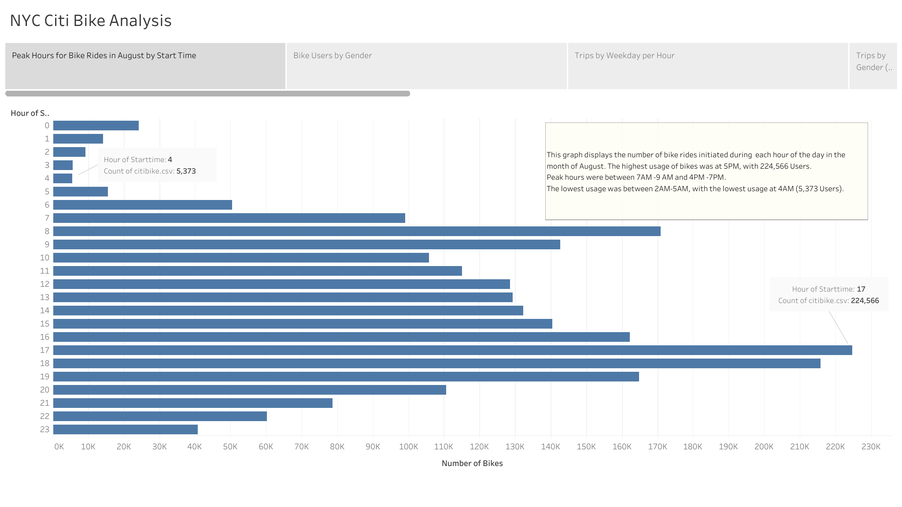
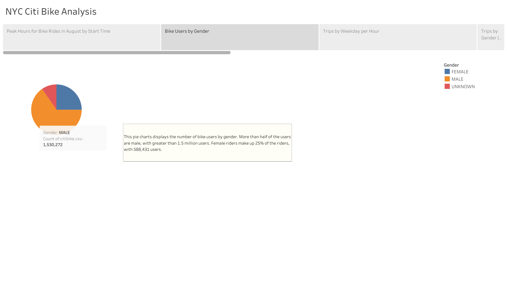
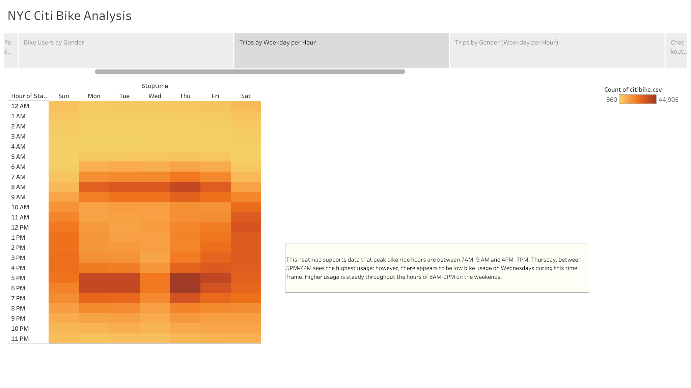
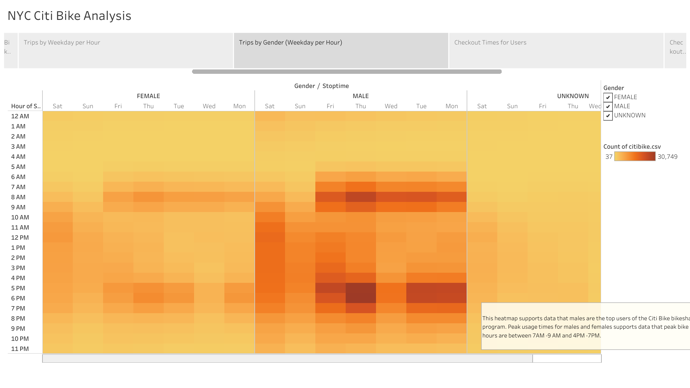
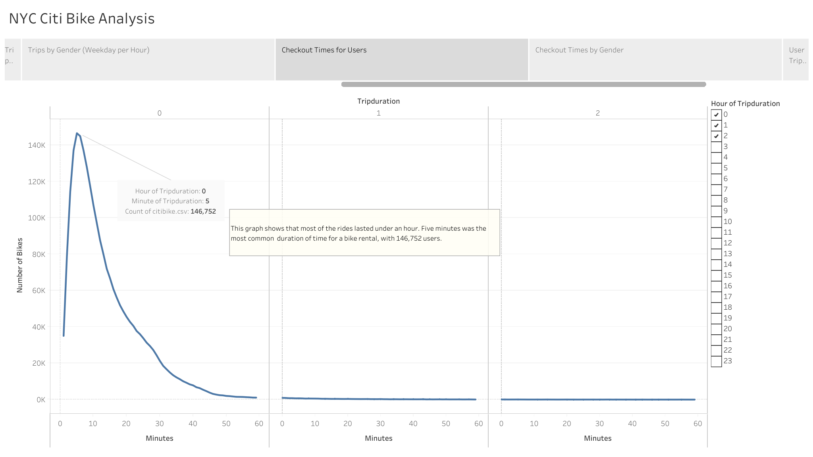
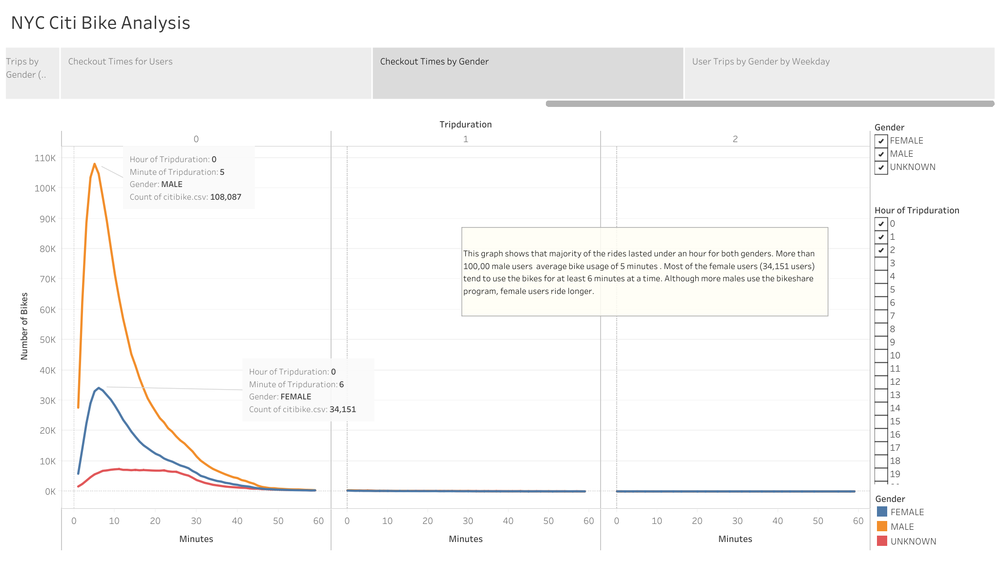
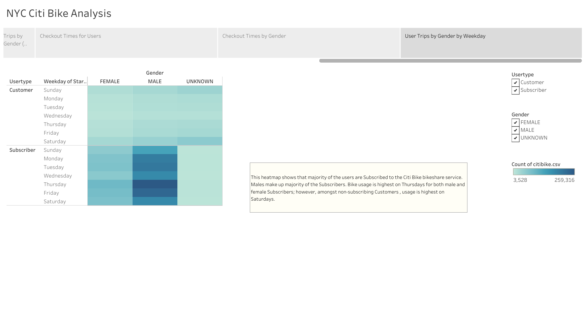

# NYC Citi Bike Analysis

## Overview of Project

### Purpose
The purpose of this project was to assist Kate with a business proposal to display how a bikesharing business may work in Des Moines, Iowa. To do so, NYC Citi Bike data from the month of August was analyzed to understand how the bikeshare business operates. This included analyzing data of bike usage based on the time of day, the weekday, gender, and trip duration. The objectives were to:
 
- Show the length of time that bikes are checked out for all riders and genders.
- Show the number of bike trips for all riders and genders for each hour of each day of the week.
- Show the number of bike trips for each type of user and gender for each day of the week.

### Resources
Data Source: [Citi Bike August Data](https://s3.amazonaws.com/tripdata/index.html); Select 201908-citibike-tripdata.csv.zip
 
Software: Jupyter Notebook, Tableau Desktop Public Edition version 2020.4.2

## Results
<b>Link to Tableau story:</b> [NYC Citi Bike Analysis](https://public.tableau.com/shared/Y9ZXQ25N7?:display_count=y&:origin=viz_share_link)
 
 
<b>The following visualizations represent the results of the analysis.</b>
 
### Peak Hours for Bike Rides in August

 
This graph displays the number of bike rides initiated during  each hour of the day in the month of August. The highest usage of bikes was at 5PM, with 224,566 Users.
Peak hours were between 7AM -9 AM and 4PM -7PM. The lowest usage was between 2AM-5AM, with the lowest usage at 4AM (5,373 Users).
 
### Bike Users by Gender

 
This pie charts displays the number of bike users by gender. More than half of the users are male, with greater than 1.5 million users. Female riders make up 25% of the riders, with 588,431 users.
 
### Trips by Weekday per Hour

 
This heatmap supports data that peak bike ride hours are between 7AM -9 AM and 4PM -7PM. Thursday, between 5PM-7PM sees the highest usage; however, there appears to be low bike usage on Wednesdays during this time frame. Higher usage is steady throughout the hours of 8AM-9PM on the weekends.
 
### Trips by Gender (Weekday per Hour)

 
This heatmap supports data that males are the top users of the Citi Bike bikesharing program. Peak usage times for males and females supports data that peak bike ride hours are between 7AM -9 AM and 4PM -7PM.
 
### Checkout Times for Users

 
This graph shows that most of the rides lasted under an hour. Five minutes was the longest duration of time for a bike rental, with 146,752 users.
 
### Checkout Times by Gender

 
This graph shows that majority of the rides lasted under an hour for both genders. More than 100,00 male users  average bike usage of 5 minutes . Most of the female users (34,151 users) tend to use the bikes for at least 6 minutes at a time. Although more males use the bikeshare program, female users ride longer.
 
### User Trips by Gender by Weekday

 
This heatmap shows that majority of the users are Subscribed to the Citi Bike bikeshare service. Males make up majority of the Subscribers. Bike usage is highest on Thursdays for both male and female Subscribers; however, amongst non-subscribing Customers , usage is highest on Saturdays.

## Summary

### Summary of Results
The analysis shows that:
- Peak hours for rides occur between 7AM-9AM and 4PM-7PM, with 6PM being the most popular time for users. This corresponds with normal work hours- users rent a bike on their way to work between 7AM-9AM, and rent a bike in the afternoon when heading home, between 4PM-7PM. The high bike usage could be due to lower costs when compared to other forms of transportation.
- The highest usage of Citi Bikes during peak hours occurs on Thursdays. This anomaly would need further investigation to understand why Thursday is a popular day for bike usage.
- There appears to be low-usage on Wednesdays between peak afternoon hours of 4PM-7PM. It can be inferred that many people do not rent bikes on Wednesday evenings due to afterwork events, such as happy hours. These types of events are common on Wednesday, i.e., Wine Down Wednesdays, and would require safer travel option, including taxis, rideshare options, or the subway.
- Males more likely than females to subscribe or use the bikeshare business. This is most likely due to concerns for safety. Women may not feel safe riding their bikes in the busy streets of New York. With a lack of bike parking spaces or designated bike lanes, woman are less likely to bike around the city.
- Users are more likely to use bikes for less than one hour, with the most common time being 5 minutes. It can be understood that the bikes are used for short distances, rather than longer commutes, and possibly more for convenience than actual exercise.

### Additional Visualizations
For further analysis:
- A visualization that displays bike usage during colder months would be needed to fully grasp how successful Kate's bikesharing business would be throughout the whole year. 
- It would also be helpful to create a visualization, such as a pie chart, that shows the age range of bike users. After this analysis, Kate could compare population data from Des Moines to that of New York to determine if the population in Des Moines would benefit from a bikesharing program, and if there would be enough customers who are likely to subscribe.
